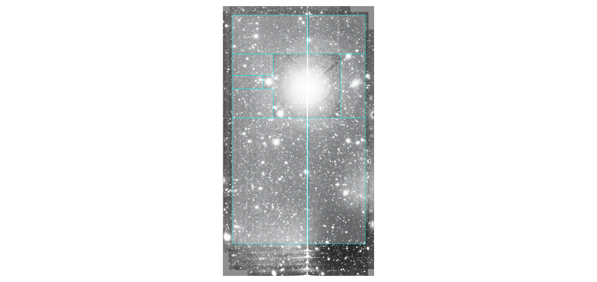
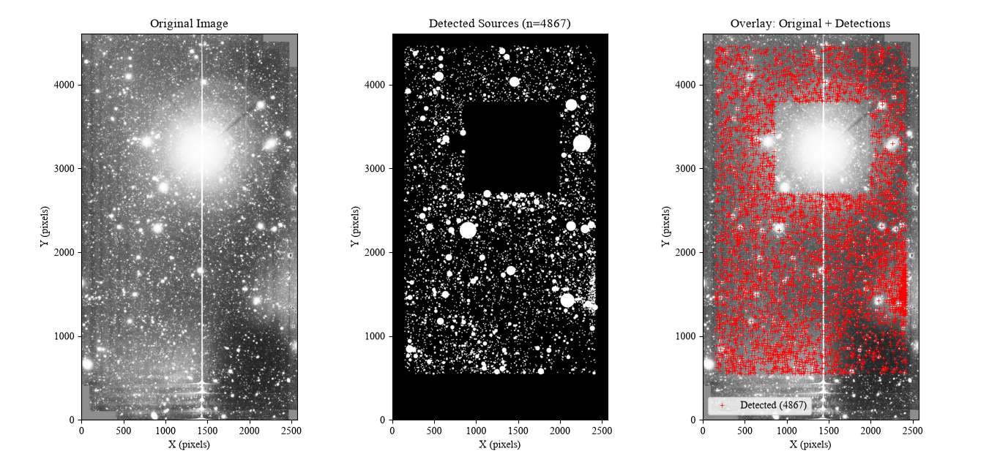
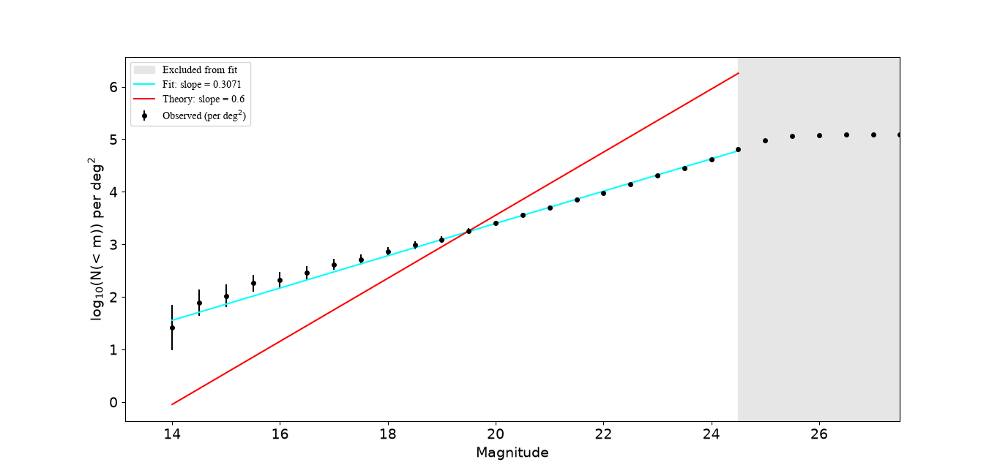
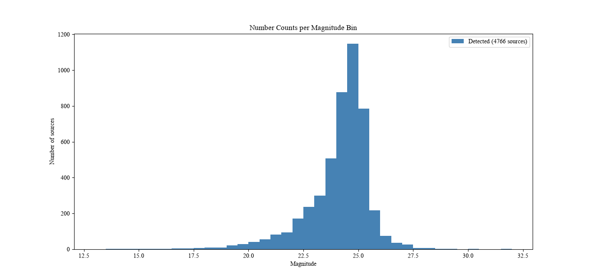

# Counting Galaxies in a Deep Sky Image

*[日本語はこちら / Japanese version below](#日本語版)*

<p align="center">
  
</p>

## What is this?

This project takes a real photograph of deep space (taken with the 4-metre telescope at Kitt Peak Observatory, USA) and answers a simple-sounding question: **how many galaxies are in this picture, and how bright is each one?**

That's harder than it sounds. The image contains thousands of faint smudges of light sitting on top of background noise, plus very bright stars that "bleed" streaks across the camera sensor and jagged edges where multiple exposures didn't quite overlap. So I wrote a program that works through the problem in four steps.

### Step 1 — Choose which parts of the image to trust

The raw image has damaged areas: a huge star in the upper centre bleeds a vertical line across the whole frame, and the edges are noisier because fewer exposures cover them. Rather than let those areas pollute the results, I hand-picked 8 rectangular regions (the cyan boxes in the image above) that avoid the bright star, the bleed lines, and the noisy edges. Everything else in the analysis happens inside those boxes only.

### Step 2 — Measure the background

Even "empty" night sky isn't perfectly dark — there's a glow from the atmosphere plus electronic noise from the camera. To measure it, I made a histogram of pixel brightness for each region and fitted a bell curve (Gaussian) to it. The peak of that curve is the typical empty-sky brightness, and its width tells you how much the noise wobbles around that value. Each of the 8 regions gets its own background measurement, because the background genuinely varies across the image.

### Step 3 — Find the galaxies and measure their brightness

The detector works like this: find the brightest pixel that stands clearly above the background (more than 3 noise-widths above it). That's a candidate galaxy. Then grow a ring outward around it, one pixel at a time, checking the typical brightness of each ring — when the ring fades back down to near background level, that's the edge of the galaxy. Mark everything inside as "found" so it isn't counted twice, then repeat with the next brightest pixel, until nothing above the threshold remains.

The exact "when has the ring faded enough?" setting matters a lot — set it too strict and you chop galaxies short, too loose and neighbouring galaxies get wrongly merged into one blob. I tested a range of values on a crowded patch of the image and picked the value where merging wasn't yet a problem (see the report for details).

For brightness, each galaxy's light is added up inside its measured radius, and the local background (measured in a ring around it, carefully excluding any other galaxies that fall in that ring) is subtracted. The result is converted to the standard astronomers' brightness scale (magnitudes) using a calibration value stored in the image file itself.

<p align="center">
  
</p>

*Left: the original image. Middle: every source the program found (n = 4867 — the dark rectangle is the excluded bright-star region). Right: the detections marked in red on top of the original.*

### Step 4 — Count them by brightness and compare with theory

With a catalogue of ~4,800 galaxies, I counted how many are brighter than each brightness level, and plotted how that count grows as you include fainter and fainter galaxies. A classic theoretical prediction says this count should grow at a specific rate (a slope of 0.6 on a log plot) if galaxies are spread uniformly through space.

<p align="center">
  
</p>

My measured slope came out at **0.307 ± 0.004** — noticeably shallower than the theoretical 0.6. The grey region on the right shows where the count flattens out entirely: the faintest galaxies become progressively harder to detect, so the survey misses more and more of them (this is called *incompleteness*), and those points are excluded from the fit. The gap between my slope and 0.6 even in the fitted range is dominated by systematic effects in the detection method — quantifying that difference, and working out where it comes from, was the point of the project.

<p align="center">
  
</p>

*How many galaxies were detected at each brightness. The peak around magnitude 25 followed by the sharp drop-off shows the detection limit of the survey — beyond this, galaxies exist but are too faint for the method to find.*

## The files

| File | What it does |
|---|---|
| `src.py` | The main pipeline. Reads the image, detects galaxies in the 8 hand-picked regions, merges duplicate detections near region boundaries, measures each galaxy's brightness, saves a catalogue, and makes the plots above. |
| `visualise_tiles.py` | Draws the 8 analysed regions on top of the image (the picture at the top of this page), so you can see exactly which parts were used and which were avoided. |
| `catalogue.csv` | Example output from `src.py` — the list of detected galaxies with their positions and brightnesses. |

## Running it

You'll need Python 3 and a few libraries:

```
pip install -r requirements.txt
```

You'll also need the image itself (`mosaic.fits`, ~23 MB) placed in the same folder — it's the deep survey image provided as part of Imperial College London's third-year lab course, so it isn't included in this repository.

Then:

```
python src.py              # full pipeline: detect, measure, catalogue, plots
python visualise_tiles.py  # show which regions of the image were analysed
```

## Report

The full write-up (method, results, error analysis) is in [`report.pdf`](report.pdf).

---

# 日本語版

<a name="日本語版"></a>

## これは何？

<p align="center">
  
</p>

このプロジェクトは、実際の深宇宙の画像(アメリカ・キットピーク天文台の4m望遠鏡で撮影)を使って、シンプルに聞こえる問いに答えるものです。**この画像には銀河がいくつ写っていて、それぞれどのくらいの明るさなのか？**

これは見た目より難しい問題です。画像には、背景ノイズの上に何千もの淡い光の点が写っており、明るい星がセンサー上に筋状の「にじみ」を作り、複数の露光の継ぎ目にはギザギザした縁も残っています。そこで、4つのステップで処理を行うプログラムを書きました。

### ステップ1 — 画像のどの部分を信頼するかを選ぶ

元の画像には損傷した領域があります。上部中央の非常に明るい星が画像全体に縦線状のにじみを作っており、端の部分は露光回数が少ないためノイズが多くなっています。これらが結果を汚染しないよう、明るい星・にじみ・ノイズの多い端を避けた8つの長方形領域(ページ上部の画像のシアンの枠)を手動で選びました。以降の解析はすべてこの枠内のみで行われます。

### ステップ2 — 背景を測定する

「何もない」夜空も完全な暗闇ではなく、大気の光やカメラの電子ノイズがあります。これを測定するため、各領域のピクセル輝度のヒストグラムを作り、ベル型の曲線(ガウス分布)をフィットさせました。曲線のピークが典型的な「空」の明るさで、幅がノイズの揺らぎの大きさを表します。背景は画像内で実際に変化するため、8つの領域ごとに個別に測定しています。

### ステップ3 — 銀河を見つけて明るさを測る

検出の仕組みはこうです。まず、背景より明確に明るいピクセル(ノイズ幅の3倍以上)を探します。これが銀河の候補です。次に、その周りに1ピクセルずつリングを広げていき、各リングの典型的な明るさを確認します。リングの明るさが背景レベル近くまで下がったら、そこが銀河の縁です。見つけた範囲を「検出済み」として記録し、二重に数えないようにしてから、次に明るいピクセルへと繰り返します。

「リングがどこまで暗くなったら止めるか」という設定は非常に重要です。厳しすぎると銀河が途中で切れてしまい、緩すぎると隣り合う銀河が誤って1つに統合されてしまいます。銀河が密集した領域で設定値を変えながらテストし、統合がまだ問題にならない値を選びました(詳細はレポートを参照)。

明るさは、各銀河の半径内の光を合計し、周囲のリングで測定した局所的な背景光(リング内に他の銀河が入っている場合は慎重に除外)を差し引いて求めます。結果は、画像ファイル自体に保存されている較正値を使って、天文学の標準的な明るさの尺度(等級)に変換されます。

<p align="center">
  
</p>

*左: 元画像。中央: プログラムが検出したすべての天体(n = 4867。黒い長方形は除外した明るい星の周辺領域)。右: 検出結果を赤で元画像に重ねたもの。*

### ステップ4 — 明るさごとに数えて理論と比較する

約4,800個の銀河のカタログをもとに、各明るさレベルより明るい銀河の数を数え、暗い銀河まで含めていくと数がどう増えるかをプロットしました。古典的な理論予測では、銀河が宇宙に一様に分布していれば、この数は特定の割合(対数プロットで傾き0.6)で増えるはずです。

<p align="center">
  
</p>

測定された傾きは **0.307 ± 0.004** で、理論値の0.6より明らかに緩やかでした。プロット右側のグレーの領域は数え上げが完全に頭打ちになる範囲で、暗い銀河ほど検出が難しくなり、見逃しが増えていきます(これを「不完全性」と呼びます)。この範囲はフィットから除外しています。フィット範囲内でも理論との差が残るのは、主に検出手法に由来する系統誤差によるものです。その差を定量化し、原因を考察することがこのプロジェクトの目的でした。

<p align="center">
  
</p>

*各明るさで検出された銀河の数。等級25付近でピークを迎えたあと急激に減少しているのが、この観測の検出限界を示しています。これより暗い銀河は実際には存在していても、この手法では検出できません。*

## ファイル構成

| ファイル | 内容 |
|---|---|
| `src.py` | メインのパイプライン。画像を読み込み、8つの領域で銀河を検出し、領域の境界付近の重複検出を統合し、各銀河の明るさを測定し、カタログを保存して上のプロットを作成します。 |
| `visualise_tiles.py` | 解析に使用した8つの領域を画像上に描画します(ページ上部の画像)。どの部分を使い、どの部分を避けたかが一目で分かります。 |
| `catalogue.csv` | `src.py` の出力例 — 検出された銀河の位置と明るさの一覧です。 |

## 実行方法

Python 3 といくつかのライブラリが必要です:

```
pip install -r requirements.txt
```

また、画像ファイル(`mosaic.fits`、約23MB)を同じフォルダに置く必要があります。これはインペリアル・カレッジ・ロンドンの3年次実験で提供されたデータのため、このリポジトリには含まれていません。

```
python src.py              # フルパイプライン: 検出、測定、カタログ作成、プロット
python visualise_tiles.py  # 解析に使用した領域の表示
```

## レポート

詳細な手法・結果・誤差解析は [`report.pdf`](report.pdf) をご覧ください。
